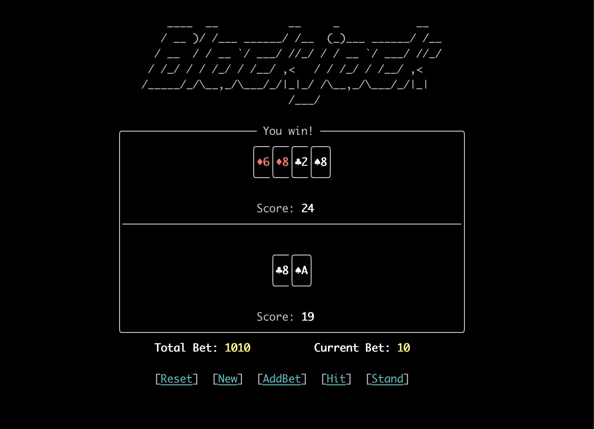

# CSE 230 - Final Project

## Blackjack

This project is aimed at implementing a Blackjack game based on Haskell and Brick library.



### How to start the game

```
stack build
stack exec blackjack
```

### Rules

The general object of the game is easy to understand: getting a total card score as close to 21 as possible, without going over 21. The score of each card is shown in this table:

|  card   |        score        |
| :-----: | :-----------------: |
|    A    |       1 or 11       |
|   2-10  | same as card number |
| J, Q, K |         10          |

The player and the virtual rival both get two cards at the beginning of the game, and the player can see one of the rival's cards. The player may choose not to ask for another card and "stand" on the two cards originally dealt to them, or may ask for additional cards ("hit"), one at a time, until deciding to "stand" on the total (if it is 21 or under), or goes "bust" (if it is over 21). In the latter case, the player loses. Otherwise, the rival follows the same procedure as the player. Finally, if the rival's score goes "bust" then the player wins, otherwise the one with a higher score is the winner.

### Goals

The general goal is to create a Blackjack game panel with command line user interface, implementing all the game rules described above. To be more specific, the features to implement include:

+ Basic game logic
+ User interface design and user input handling
+ Strategy of the virtual rival
+ (Additional) involving bets system in the game
+ (Additional) import networking modules to support online gaming

\* We will choose whether or not to include additional items based on actual development progress in the future.

### Members

* Yiming Mao(@[leafeonia](https://github.com/leafeonia))
* Shiqi Wang(@[shiqi-wang](https://github.com/shiqi-wang))
* Xiaoyang Wu(@[BryanWuxiaoyang](https://github.com/BryanWuxiaoyang))

### Links

Project requirements: https://ucsd-cse230.github.io/fa21/project.html<br>
Brick library: https://github.com/jtdaugherty/brick/

# Updates

## Architecture

### Data type module

This module defines basic data structures related to the game. Important data types include:

**Card** 

There are various attributes of a card. In this module, we first define data type describing a single card. Such data structure should include:

+ Rank: the rank on the card include 'A', 'J', 'Q', 'K' and '2' to '10'.
+ Suit: four suits of a card also needs to be defined here.
+ Face direction: this attribute decides whether the rank and suit of a card will be rendered or hidden in the user interface.

**Game state**

The state of a game also needs to be defined according to Brick. We save all the information required to describe a game state here:

+ Field: two piles of cards for player and rival.
+ Total bet: the total number of bets player have.
+ Current bet: the bet set for the current game.
+ Done: whether current game has finished. If so, the player cannot do operations other than starting a new game.
+ Seed: random seed to generate random number.
+ Deal: the card deal that current game is using.

### UI module

The UI module is responsible for rendering user interface.

The UI interface is comprised of two card piles at the top and bottom respectively, representing the cards for the rival and player, and bets and buttons on the bottom to show and change game state. 

A card is consisted of the border, a number and the suit of it. Depending on the direction of a card, it might render either all the 3 elements or only the border of the card (signaling it's invisible to the player).

To render the card pile of the rival, the rightmost card is displayed completed, and other cards only displays their left-half borders, making it covered by other cards.

### Logic module

Logic module handles all the logics in the game.

* Click 'reset'

  Total bets, current bets and status of the game are all initialized to default.

* Click "new"

  Start a new game. Current bet and the status of the game are initialized to default.

* Click "addBet"

  Add 10 to current bet of a game.

* Click 'hit'

  one card from the card case will be moved to the front of the player and place face up

  * when the sum of the cards is smaller than 21, the player could still press 'Hit' or 'Stand'
  * when the sum of the cards is equal to 21, turn to dealer round which is described in 4, and show the result according to the sum
  * when the sum of the cards is larger than 21, turns to dealer round which is described in 4 and shows 'You lose...'

* Click 'stand'

  Turns to dealer round which is described in 4, and show the result according to the sum

* Dealer's turn

  The facedown card of the dealer will turn up, and the dealer may start adding new facing-up cards, after the dealer get the cards, the result of the game would be shown

## Challenges

* We met a minor challenge yet it is still worthy of discussion. When designing how to draw a card, there is an unique card: card with value 10. It is troublesome because 10 has 2 characters, and all the designs must take this exception into account. To avoid unnecessary edge cases, we find that there is an unicode value that can draw '10' in a single character. in this way we reduced the complexity, along with designing the user interface in a more general approach.

* brick version, base version, and LTS compatibility

  when trying to use brick 0.26 on Ubuntu 18, the stack build showed that the base version is not compatible. So I tried to downgrade the ghc version, but encountered another problem: could not download 7.x.x ghc version to local. I changed the method by upgrading LTS version to a little higher version and also upgrading brick version a bit higher according to the version table. The building process then threw another error of lacking one lib file libtinfo.so related to vty. Finally, this problem was solved by this [post](https://github.com/commercialhaskell/stack/issues/1012).

## Goals expectation

With current progress, we think we can finish the original proposed goals on time. But the additional goals may not be implemented.

## Acknowledgement

We are enlightened on how to design a card game by [this article](https://jbuckland.com/2017/12/02/solitaire.html).
